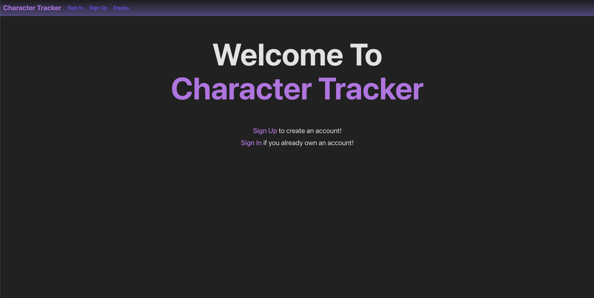

# Character Tracker
Our group chose to make an app where users can create character sheets and add items (equips) to their sheet to dynamically update their stats. Our project allow users to create, read, update and delete these sheets while allowing users to create/add their own equips, or use equips already in our database.

## Getting started
You can find our [deployed site here](https://character-tracker.netlify.app/)

Our planning materials [can be found here](https://trello.com/b/IFw6AVnT/charcter-gear-wip-name)

## Attributions
### Online documentation
 - Our group used websites like [MDN](https://developer.mozilla.org/en-US/) and [W3] (https://www.w3schools.com/) throughout our project whenever we got stuck.
 ### Class notes and labs
-  We used class notes like the [Hoot API Back-end](https://github.com/michaelmcbride113/express-api-hoot-back-end) and labs like the [React Jukebox front end lab](https://github.com/michaelmcbride113/react-jukebox-front-end-lab) for guidance when styling our application

## Technologies Used: 
1. **HTML**

2. **CSS**

3. **Javascript**

4. **data.js**

## Next steps

1. **Add in locations and quotes as options for answers**
* 

2. **Update images with images I make myself**
* 
3. **Update website to mirror website from the show**
* 